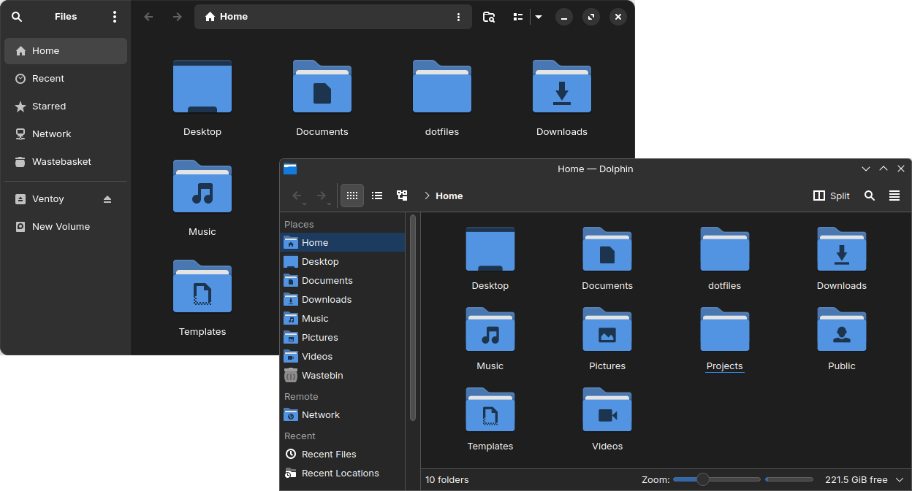

## Breeze Libadwaita

KDE color scheme to unify Breeze and Libadwaita.



### Installation

1. Copy the color file

    ```sh
    cp ./color-schemes/BreezeLibadwaitaDark.colors ~/.local/share/color-schemes/
    ```

2. Apply the theme using KDE Settings

    - System Settings > Colors & Themes > Colors > Breeze Libadwaita Dark
    - If you are not on KDE, apply it using [qt5ct-kde](https://aur.archlinux.org/packages/qt5ct-kde) and [qt6ct-kde](https://aur.archlinux.org/packages/qt6ct-kde)

### Recommendation

Extra steps to match Libadwaita window decorations

1. Install [Papirus Icon](https://github.com/PapirusDevelopmentTeam/papirus-icon-theme)

2. Install [Klassy KDE Plugin](https://github.com/paulmcauley/klassy), and set:

    - System Settings > Colors & Themes > Application Style > Klassy
    - System Settings > Colors & Themes > Window Decorations > Klassy
    - System Settings > Colors & Themes > Icons > Papirus Dark
    - Klassy Settings > Presets > Add > Import [this preset](https://github.com/moktavizen/breeze-libadwaita/blob/main/klassy-preset/Breeze_Libadwaita.klpw) > Load
    - Reboot
