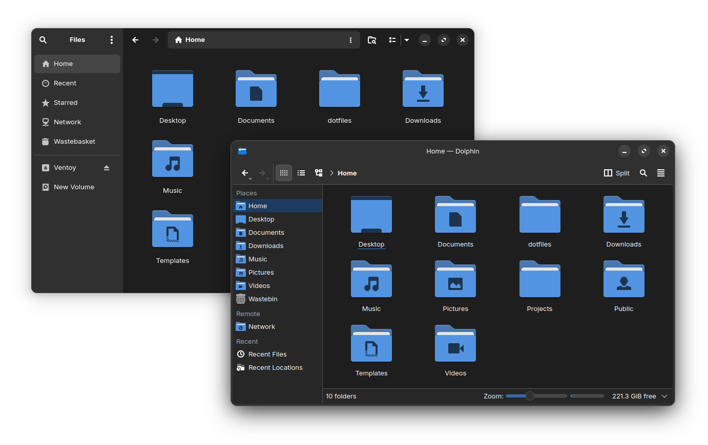

## Breeze Libadwaita

KDE theme to unify Breeze and Libadwaita.



### Installation

1. Copy the theme files

    ```sh
    cp ./color-schemes/BreezeLibadwaitaDark.colors ~/.local/share/color-schemes/
    ```

2. Apply the theme using KDE Settings, if you are not on KDE, apply it using
[qt5ct](https://aur.archlinux.org/packages/qt5ct-kde) and [qt6ct](https://aur.archlinux.org/packages/qt6ct-kde)
